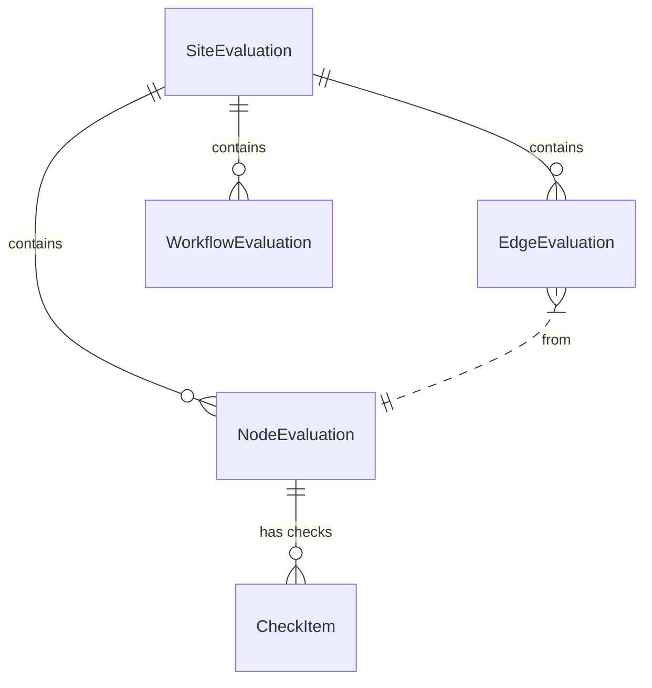

# **Website UI/UX Analysis**

## 목차
1. [팀원 소개](#팀원-소개)
2. [서비스 소개](#서비스-소개)
3. [기술 스택](#기술-스택)
4. [데이터베이스 스키마](#데이터베이스-스키마)
5. [핵심 기능](#핵심-기능)
6. [주요 구현 개념](#주요-구현-개념)

---

## 팀원 소개
> *팀원 정보가 제공되지 않았습니다. (Placeholder)*

- **[이름]**: [역할]
- **[이름]**: [역할]
- **[이름]**: [역할]

---

## 서비스 소개
**MADCAMP W3 UI Grader**는 웹사이트의 UI/UX 품질을 자동으로 분석하고 점수화하여 개선점을 제안하는 서비스입니다. 사용자가 분석하고자 하는 웹사이트의 URL을 입력하면, 크롤링 및 시뮬레이션을 통해 사용자 경험을 정량적으로 평가합니다.

- **Learnability (학습 용이성)**: 새로운 사용자가 얼마나 쉽게 시스템을 익힐 수 있는지 평가
- **Efficiency (효율성)**: 숙련된 사용자가 작업을 얼마나 빠르게 수행할 수 있는지 평가 (KLM, Fitts's Law 등)
- **Control (통제성)**: 사용자가 시스템을 얼마나 자유롭게 제어하고 오류를 복구할 수 있는지 평가

---

## 기술 스택
### Frontend
- **Framework**: `Next.js 16.1.5` (App Router)
- **Library**: `React 19.2.3`
- **Language**: `TypeScript`
- **Styling**: `Tailwind CSS 4`
- **State Management**: React Hooks (useState, useEffect)
- **Data Fetching**: Native `fetch` with API routes

### Backend (Inferred)
- **API**: RESTful API (Nodes, Edges, Workflows analysis)
- **Automation**: Headless Browser (Puppeteer/Playwright - inferred from screenshot capabilities)

---

## 데이터베이스 스키마
본 프로젝트는 API 기반으로 데이터를 통신하며, 주요 데이터 모델(Entity)은 다음과 같습니다.

### 핵심 엔티티 요약
1. **SiteEvaluation**: 전체 사이트 분석 결과의 루트 엔티티
2. **NodeEvaluation**: 개별 페이지(Node) 단위의 정적 분석 결과
3. **EdgeEvaluation**: 페이지 간 전환(Action) 및 상호작용 분석 결과
4. **WorkflowEvaluation**: 주요 사용자 시나리오(Path) 단위의 흐름 분석 결과

### 주요 테이블 요약 (Type Definition)

#### 1. SiteEvaluation (사이트 평가)
| Field | Type | Description |
|---|---|---|
| `run_id` | UUID | 분석 실행 고유 ID |
| `target_url` | String | 분석 대상 URL |
| `total_score` | Float | 전체 종합 점수 |
| `learnability_score` | Float | 학습 용이성 점수 |
| `efficiency_score` | Float | 효율성 점수 |
| `control_score` | Float | 통제성 점수 |

#### 2. NodeEvaluation (페이지 평가)
| Field | Type | Description |
|---|---|---|
| `node_id` | UUID | 페이지 고유 ID |
| `url` | String | 페이지 URL |
| `learnability_items` | Array | 학습 용이성 체크리스트 결과 |
| `efficiency_items` | Array | 효율성 체크리스트 결과 |
| `control_items` | Array | 통제성 체크리스트 결과 |

#### 3. EdgeEvaluation (상호작용 평가)
| Field | Type | Description |
|---|---|---|
| `edge_id` | UUID | 상호작용 고유 ID |
| `from_node_id` | UUID | 출발 페이지 ID |
| `action` | String | 수행한 동작 (Click, Input 등) |
| `latency` | Object | 응답 지연 시간 분석 결과 |

#### 4. WorkflowEvaluation (시나리오 평가)
| Field | Type | Description |
|---|---|---|
| `path_index` | Integer | 시나리오 순번 |
| `path_summary` | String | 경로 요약 (Node ID Flow) |
| `interaction_efficiency` | Object | KLM(Keystroke-Level Model) 분석 |
| `fitts_issues` | Array | Fitts's Law 위반 사례 |

### 제안 상태 전이
*(본 프로젝트는 상태 전이보다는 "분석 -> 결과 도출 -> 시각화"의 단방향 파이프라인 구조를 따릅니다.)*
1. **Request**: URL 입력 및 분석 요청 (`ValidateUrlResponse`)
2. **Processing**: 백엔드 크롤링 및 평가 수행 (`RunListItem.status` = 'running')
3. **Completion**: 결과 JSON 생성 및 저장 (`RunListItem.status` = 'completed')
4. **Respnse**: 프론트엔드에서 상세 리포트 조회 (`AnalyzeResponse`)

### ERD
> *TypeScript 인터페이스 구조를 기반으로 한 모델링*

---

## 핵심 기능

### 1. Dashboard (대시보드)
- 최근 분석 이력 목록 조회
- 분석 상태(Running, Completed, Failed) 실시간 확인
- 종합 점수 및 카테고리별(Learnability, Efficiency, Control) 점수 요약

### 2. Page Analysis (페이지 단위 분석)
- **Screenshots**: 각 페이지의 스크린샷과 함께 문제를 시각적으로 확인
- **Heuristic Checklist**: UI 요소별(Button, Input 등) 표준 준수 여부 체크
- **Metric Filtering**: 페이지 단위에서는 `Learnability`와 `Control` 중심의 평가 제공

### 3. Interaction Analysis (상호작용 분석)
- **Action Tracking**: 클릭, 입력 등 사용자 행동에 따른 반응 분석
- **Latency Check**: 시스템 응답 속도가 UX에 미치는 영향 평가 (Slow/Fast)
- **Efficiency Score**: 페이지별 상호작용 효율성 점수 표시

### 4. Workflow Analysis (시나리오 흐름 분석)
- **Filmstrip View**: 사용자 이동 흐름을 스크롤 가능한 이미지 시퀀스로 시각화
- **KLM Analysis**: Keystroke-Level Model을 통한 작업 소요 시간 예측
- **Fitts's Law**: 버튼 크기와 거리에 따른 클릭 난이도 분석 및 문제 도출

---

## 주요 구현 개념

### 1. Mock Data Integration & Fallback
- 실제 백엔드 API가 준비되지 않거나 실패할 경우, `public/mock/` 디렉토리의 JSON 데이터를 활용하여 UI 개발 및 테스트를 지속할 수 있도록 설계됨.
- **Resilient UI**: 데이터 누락(Missing Node ID) 시에도 대체 이미지를 표시하는 Fallback 로직 구현.

### 2. Metric Filtering Strategy
- 사용자 요구사항에 맞춰 분석 탭별로 노출되는 지표를 최적화:
    - **Nodes**: 정적 분석 위주 → *Learnability & Control*
    - **Edges**: 동적 반응성 위주 → *Efficiency*
    - **Workflows**: 작업 수행 효율 위주 → *Efficiency & Control*

### 3. Visual-First Layout
- 텍스트 위주의 리포트를 지양하고, **스크린샷+체크리스트**를 65:35 비율로 배치하여 시각적 직관성 극대화.
- Workflow의 복잡한 경로를 수평 스크롤 형태의 Filmstrip으로 변환하여 사용자 경험 개선.
